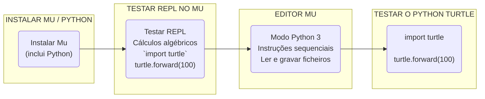
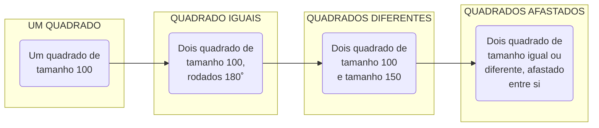
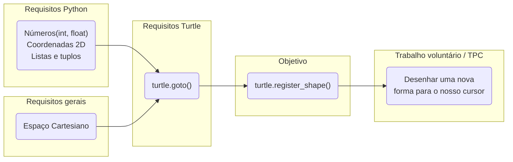

# Python Turtle · Mini-curso de 10 horas · Parte 1

## Ambiente de desenvolvimento

Objetivos:
- [X] Garantir o bom funcionamento do Mu
- [X] Testar o modo Python 3
- [X] Ler e gravar ficheiros
- [X] Correr o primeiro programa com o Python Turtle!

## Diversos mini-programas

Objetivos:
- [X] Explorar o conceito de programa, com instruções sequenciais
- [X] Analisar mensagens de erros e como ultrapassar os erros
- [X] Explorar o sistema de coordenadas cartesiano x-y e a rotação em graus
- [X] Fazer desenhos de linhas no ecrã com os métodos `forward`/`fd`, `backward`/`bk`, `left`/`lf` e `right`/`rt`
- [X] Posicionar o cursos em diferentes locais do ecrã com os métodos `penup`/`up` e `pendown`/`down`

## Missão 1: desenhar uma figura para um novo cursor

Objetivos:
- [X] Tornar o Python Turtle mais apelativo com um cursor personalizado
- [X] Introduzir o conceito de geometria (polígono) fechado
- [X] Mostrar as formas existentes para o cursor com os métodos `shape` e `shapesize`
- [X] Alterar a forma do cursor com os métodos `register_shape`/`addshape`

Diverte-te!
