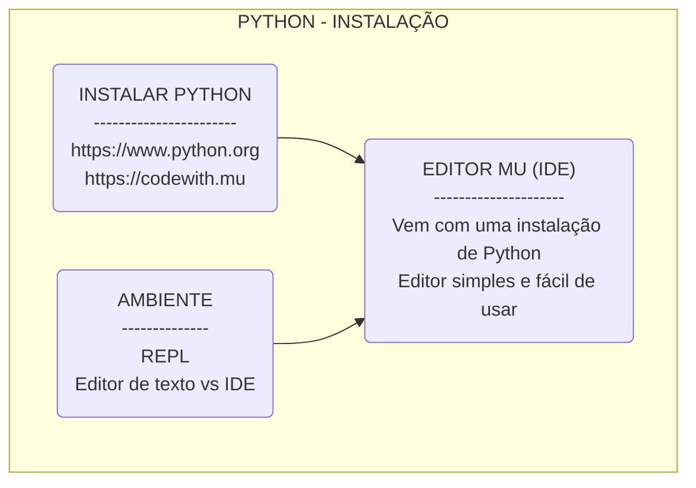
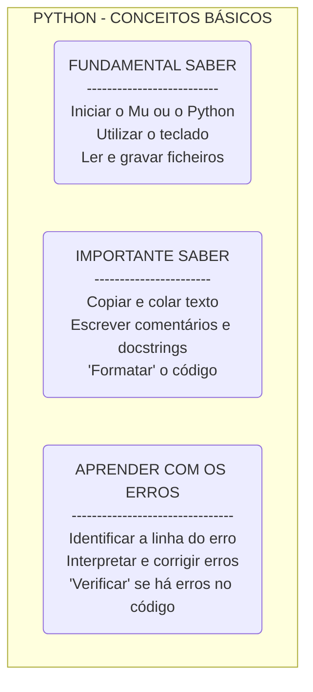
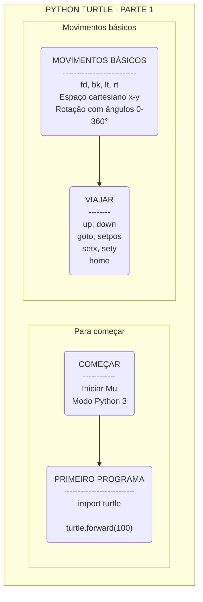
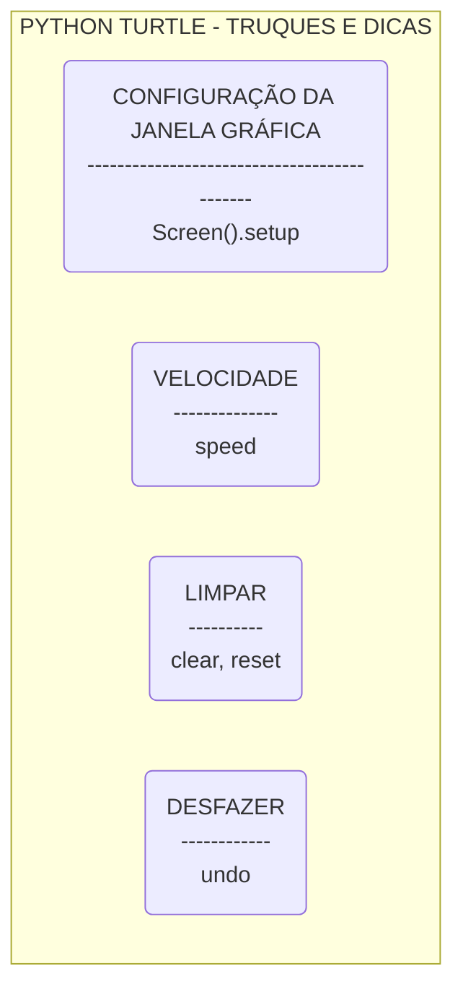
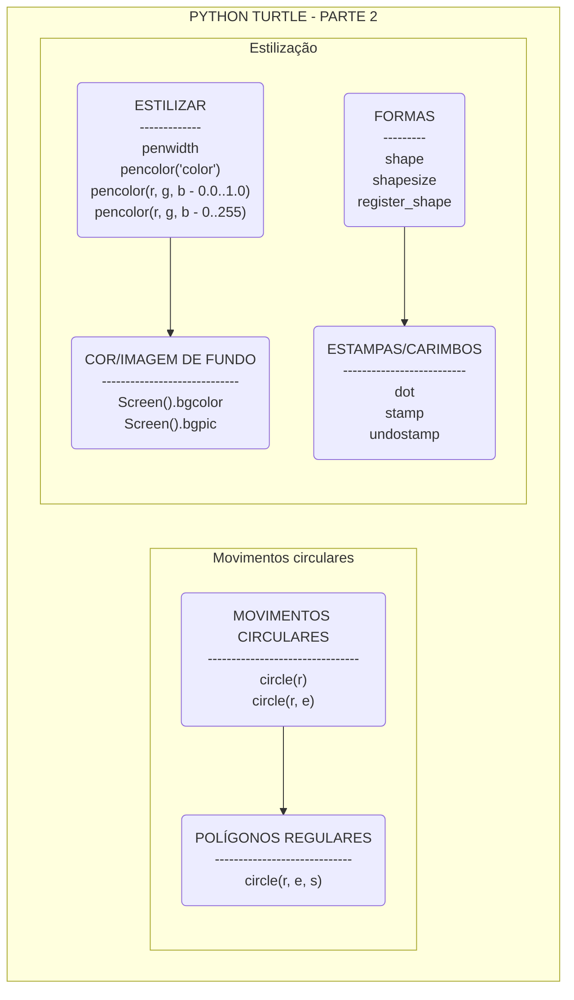

# Python Turtle - uma aventura de programação!

Este guião pretende ajudar a começar a programar em Python 3 - uma linguagem de programação que te permite criar os teus próprios programas no computador. Os passos que se seguem são uma aventura que permitir-te-ão compreender os conceitos básicos de programação enquanto fazes desenhos e jogos fantásticos baseado num módulo chamado `turtle`! Irás, também, aprender a estruturar o pensamento para mais tarde desenvolveres programas e jogos ainda mais espetaculares!

A aventura começa agora!

## Como começar

Para começarmos a programar em Python 3 é necessário termos o interpretador de Python no nosso computador e um editor de texto. Recomendamos o Editor Mu por ser simples de utilizar e trazer uma instalação de Python, simplificando o início desta aventura!

## Python turtle - parte 1

O Python conhece uma tartaruga que nos vai ensinar a programar, enquanto desenha no ecrã! Queres conhecê-la?

## Python turtle - truque e dicas

Vamos conhecer alguns truques para ser mais fácil e mais giro programar!

## Python turtle - parte 2

Agora que já sabemos como fazer desenhos simples vamos aprender a fazer desenhos mais completos... e a cores!

