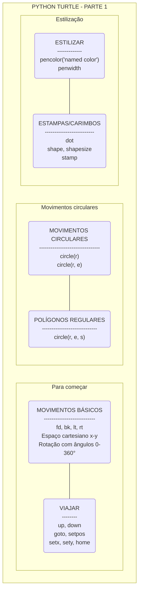
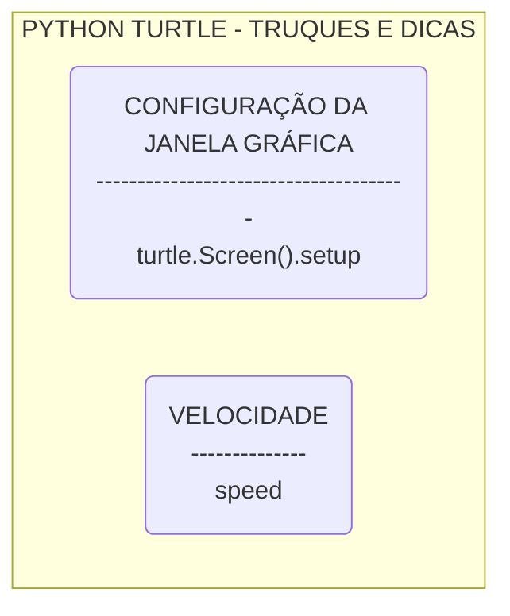

# Python Turtle Tech-Tree

Sugestão de passos para aprender Python & Python Turtle

## Diagrama de alto nível

```mermaid
  graph TD

    subgraph "PYTHON TURTLE - PARTE 1"

      subgraph "Para começar"
        %% Movimentos básicos
        MovimentoBasico("MOVIMENTOS BÁSICOS<br>---------------------------<br>fd, bk, lt, rt<br>Espaço cartesiano x-y<br>Rotação com ângulos 0-360°")
        Viajar("VIAJAR<br>--------<br>up, down<br>goto, setpos<br>setx, sety, home")
        MovimentoBasico---Viajar
      end
      
      subgraph "Movimentos circulares"
        %% Movimentos circulares
        MovimentoCircular("MOVIMENTOS CIRCULARES<br>--------------------------------<br>circle(r)<br>circle(r, e)")
        PoligonosRegulares("POLÍGONOS REGULARES<br>-----------------------------<br>circle(r, e, s)")
        MovimentoCircular---PoligonosRegulares
      end

      subgraph "Estilização"
        %% Estilização - cores e espessuras
        Estilizar("ESTILIZAR<br>-------------<br>pencolor('named color')<br>penwidth")
        Estampas("ESTAMPAS/CARIMBOS<br>--------------------------<br>dot<br>shape, shapesize<br>stamp")
        Estilizar---Estampas
      end

    end
```

```mermaid
  graph TD
  
    subgraph "PYTHON TURTLE - TRUQUES E DICAS"
      %% Truques para conforto e eficiência
      ScreenSetup("CONFIGURAÇÃO DA JANELA GRÁFICA<br>--------------------------------------<br>turtle.Screen().setup")
      Velocidade("VELOCIDADE<br>--------------<br>speed")
    end
```
