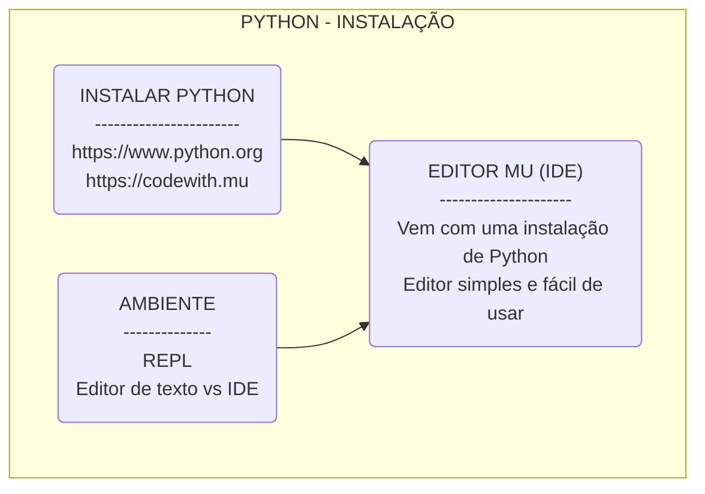
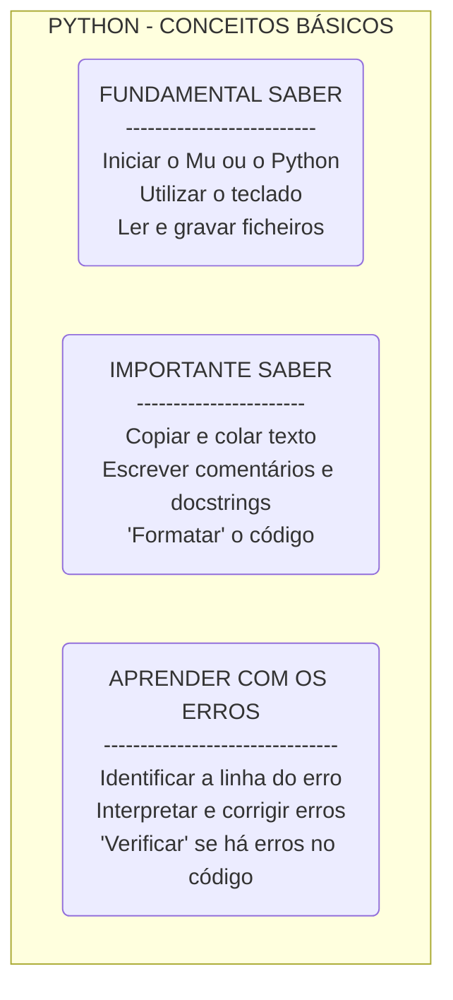
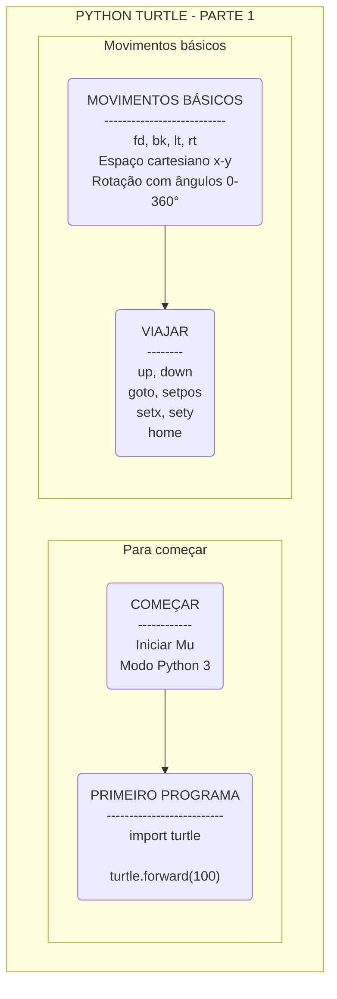
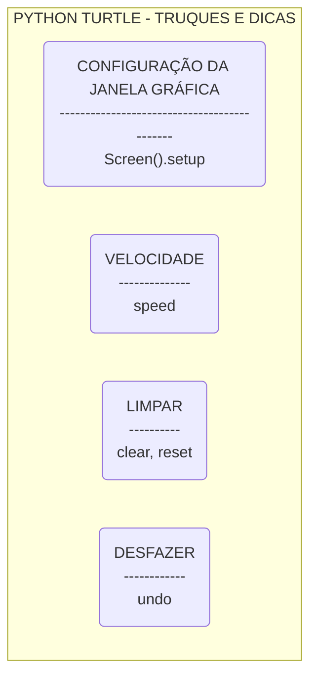
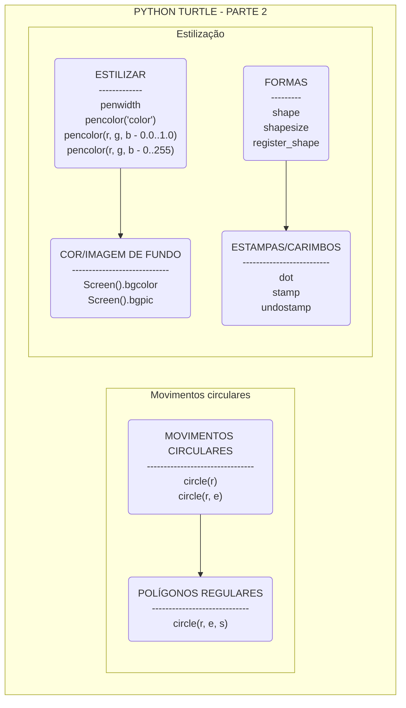

# Python Turtle - uma aventura de programação!

Este guião pretende ajudar a começar a programar em Python 3 - uma linguagem de programação que te permite criar os teus próprios programas no computador. Os passos que se seguem são uma aventura que permitir-te-ão compreender os conceitos básicos de programação enquanto fazes desenhos e jogos fantásticos baseado num módulo chamado `turtle`! Irás, também, aprender a estruturar o pensamento para mais tarde desenvolveres programas e jogos ainda mais espetaculares!

A aventura começa agora!

## Aprender a programar em Python 3

Uma linguagem de programação permite fazer quase instantaneamente cálculos matemáticos longos e complexas, analisar textos tão grandes como o maior livro do Mundo, ou desenhar imagens e jogos para nos divertirmos sozinhos ou com amigos!

Um computador, através de uma boa programação, pode repetir operações milhares (ou milhões!) de vezes de seguida sem se cansar. Podemos facilmente calcular quandos dias faltam até ao teu próximo aniversário, ou quantos segundos faltam até à meia-noite!

O Python é apenas uma de muitas linguagens de programação, e existem centenas de linguagens utilizadas atualmente. O Python é uma excelente linguagem para se aprender a programar porque é mais simples do que a maioria das linguagens e, para além de permitir construir programas de computador muito eficazes e interessantes em poucas linhas, permite também desenvolver programar complexos e completos de forma muito estruturada – se conhecermos as regras e as boas práticas, claro!

Podemos saber, por exemplo, com apenas algumas linhas de código Python, quantas palavras tem o "Os Lusíadas" – um livro com quase 300 páginas! – , qual a palavra mais utilizada e qual a que só aparece uma vez; podemos saber quantas vezes é utilizada a palavra "João" ou "Portugal", algo que nos demoraria semanas a fazer. E tudo isto em segundos!

Podemos fazer jogos, como o "Jogo da Glória" que dependem dos resultados de lançamento de dados. Podemos inventar novos dados com 7 ou 70 lados, em vez do tradicional dado de 6 lados, e os lados podem ter cores em vez de números para ajudar a colorir de forma aleatória os nossos desenhos ou jogos!

Podemos ainda produzir sons ou movimentos quando carregamos em teclas ou quando utilizamos o rato, ou simplesmente quando passa um segundo no relógio, para que os nossos jogos e animações sejam mais ricas e envolventes.

Em suma, quando programamos – especialmente com o Python – podemos ser infinitamente criativos, desde que conheçamos as palavras e os conceitos necessários para dar instruções ao computador! E a ideia é mesmo essa – somos os comandantes desta aventura, e com algum treino, conhecimento e imaginação podemos vencer qualquer desafio!

Por isso, e sem perdermos mais tempo, vamos começar a explorar este novo mundo!

## Como começar

Para começarmos a programar em Python é necessário termos o interpretador de Python no nosso computador e um editor de texto. Vamos utilizar a linguagem [Python 3](https://www.python.org/), que existe desde o dia 3 de dezembro de 2008, e que tem evoluído desde então – podes ver a evolução neste artigo em inglês [Python Version History: How Python has changed over the years](https://www.educative.io/blog/python-versions-history).

Há muitas formas de programar e correr código Python, mas recomendamos o [Editor Mu](https://codewith.mu) por ser muito simples de utilizar e trazer incluída uma instalação de Python, simplificando o início desta aventura! O editor Mu, vontade de aprender e muita criatividade é mesmo tudo o que precisamos para começar!

## Python turtle - parte 1

O Python conhece uma tartaruga que nos vai ensinar a programar, enquanto desenha no ecrã! Queres conhecê-la?

## Python turtle - truque e dicas

Vamos conhecer alguns truques para ser mais fácil e mais giro programar!

## Python turtle - parte 2

Agora que já sabemos como fazer desenhos simples vamos aprender a fazer desenhos mais completos... e a cores!

