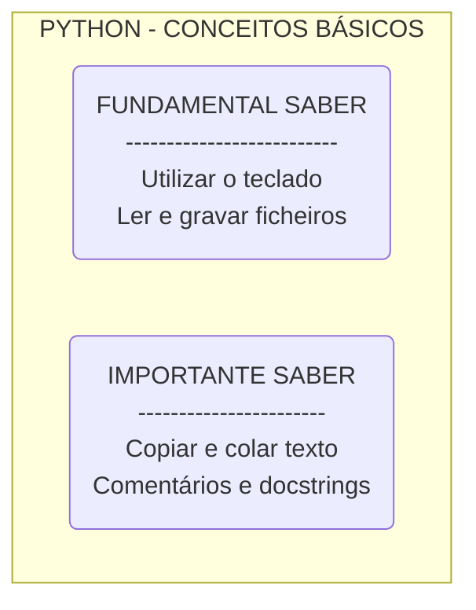

# Python Turtle Tech-Tree

Sugestão de passos para aprender Python & Python Turtle

## Como começar

Para começarmos a programar em Python 3 é necessário termos o interpretador de Python no nosso computador e um editor de texto. Recomendamos o Editor Mu por ser simples de utilizar e trazer uma instalação de Python, simplificando o início desta aventura!

## Python turtle

O Python conhece uma tartaruga que nos vai ensinar a programar, enquanto desenha no ecrã! Queres conhecê-la?

## Truque e dicas

Vamos conhecer alguns truques para ser mais fácil e mais giro programar!

## Python turtle - parte 2

Agora que já sabemos como fazer desenhos simples vamos aprender a fazer desenhos mais completos... e a cores!

